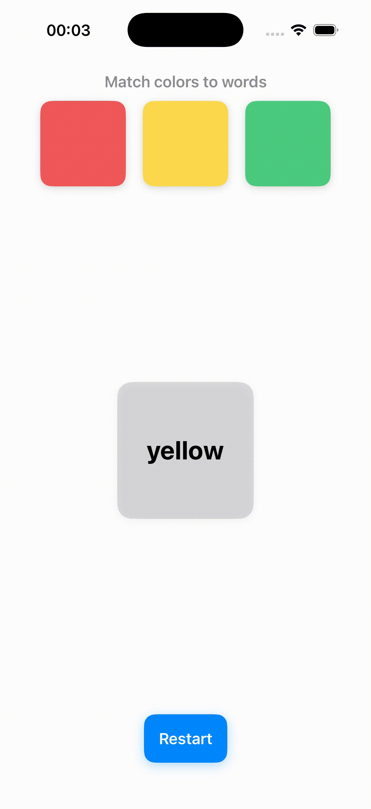

#  DragGestureGame

A simple and educational **SwiftUI color-matching game** built with **MVVM architecture**.  
Drag the correct color square onto the target square that shows a color name.

This project demonstrates gesture handling, layout management, and feedback animations in SwiftUI.

---

## Gameplay



> The goal: match each color square to its correct color name.  
> If you make a mistake, the screen shakes to indicate the wrong answer.

---

## Features

-  Built with **SwiftUI + MVVM**
-  Custom **DragGesture** implementation
-  **Shake animation** for incorrect matches
-  Responsive layout with `GeometryReader`
-  Clean and commented code (English + Russian)
-  Simple and extensible game logic

---

# Code Example

## ContentView.swift
```swift
//
//  ContentView.swift
//  DragGesture
//
//  Created by  Aleksei Kulikov on 07.11.2025.
//

import SwiftUI

// MARK: - MAIN CONTENT VIEW

// ContentView is the main view combining all components
// ContentView это главный View, объединяющий все элементы игры

struct ContentView: View {
    @StateObject private var viewModel = GameViewModel()
    
    // ViewModel handles all game logic and state
    // ViewModel управляет всей логикой и состоянием игры
    
    var body: some View {
        GeometryReader { geometry in
            
            // GeometryReader gives the available size of the screen
            // GeometryReader позволяет узнать доступный размер экрана
            
            ZStack {
                
                // ZStack allows stacking views on top of each other
                // ZStack позволяет накладывать View друг на друга
                
                VStack {
                    // Title / Заголовок
                    Text("Match colors to words")
                        .font(.headline)
                        .foregroundColor(.gray)
                        .multilineTextAlignment(.center)
                    
                    // Top draggable squares / Верхние перетаскиваемые квадраты
                    HStack(spacing: geometry.size.width * 0.05) {
                        // HStack arranges squares horizontally / HStack располагает квадраты горизонтально
                        ForEach(GameColorModel.all) { color in
                            // ForEach loops over all colors / ForEach перебирает все цвета
                            DraggableSquareView(
                                color: color,
                                squareSize: min(100, geometry.size.width / 4),
                                viewModel: viewModel
                            )
                        }
                    }
                    .frame(maxWidth: .infinity, alignment: .center)
                    
                    Spacer()
                    // Spacer pushes content apart / Spacer разделяет элементы
                    
                    // Bottom target square / Нижний квадрат цели
                    TargetSquareView(
                        viewModel: viewModel,
                        squareSize: min(160, geometry.size.width * 0.4)
                    )
                    
                    Spacer()
                    
                    // Restart button / Кнопка перезапуска
                    Button(action: viewModel.resetGame) {
                        Text("Restart")
                            .font(.headline)
                            .bold()
                            .padding()
                            .background(Color.blue)
                            .foregroundColor(.white)
                            .cornerRadius(12)
                            .shadow(color: .blue.opacity(0.3), radius: 6, x: 0, y: 3)
                    }
                }
                .offset(x: viewModel.shakeOffset)
                // Shake animation when wrong answer / Анимация тряски при неправильном ответе
            }
        }
        .padding()
    }
}

// MARK: - DRAGGABLE SQUARE VIEW

// DraggableSquareView represents a draggable color square
// DraggableSquareView представляет перетаскиваемый цветной квадрат

struct DraggableSquareView: View {
    let color: GameColorModel
    let squareSize: CGFloat
    @ObservedObject var viewModel: GameViewModel
    
    var body: some View {
        GeometryReader { geo in
            RoundedRectangle(cornerRadius: 12)
                .fill(viewModel.usedColors.contains(color) ? color.color.opacity(0) : color.color)
                .frame(width: squareSize, height: squareSize)
                .shadow(color: .black.opacity(0.15), radius: 4, x: 0, y: 2)
                // Move the square while dragging / Сдвигаем квадрат при перетаскивании
                .offset(viewModel.draggedColor == color ? viewModel.dragOffset : .zero)
                .gesture(
                    DragGesture() // Create a drag gesture / Создаем жест перетаскивания
                        .onChanged { value in
                            // Called every time the finger moves / Вызывается каждый раз, когда палец двигается
                            // value.translation contains the finger offset / value.translation содержит смещение пальца
                            
                            // Set the currently dragged color / Устанавливаем текущий перетаскиваемый цвет
                            viewModel.draggedColor = color
                            
                            // Save the drag offset to move the square / Сохраняем смещение для движения квадрата
                            viewModel.dragOffset = value.translation
                            
                            // Calculate the square center including the offset / Вычисляем центр квадрата с учётом смещения
                            let squareCenter = CGPoint(
                                x: geo.frame(in: .global).midX + viewModel.dragOffset.width,
                                y: geo.frame(in: .global).midY + viewModel.dragOffset.height
                            )
                            
                            // Highlight the target if the square overlaps / Подсвечиваем цель, если квадрат пересекает её
                            viewModel.highlightColor = viewModel.targetFrame.contains(squareCenter) ? color.color : nil
                        }
                        .onEnded { _ in
                            // Called when the finger is lifted / Вызывается, когда палец отпущен
                            
                            // Compute the final frame of the square / Вычисляем финальную рамку квадрата
                            let squareFrame = geo.frame(in: .global)
                                .offsetBy(dx: viewModel.dragOffset.width, dy: viewModel.dragOffset.height)
                            
                            // Handle drop logic in the ViewModel / Передаем логику отпускания в ViewModel
                            viewModel.handleDrop(for: color, squareFrame: squareFrame)
                        }
                )
        }
        .frame(width: squareSize, height: squareSize)
    }
}

// MARK: - TARGET SQUARE VIEW

// TargetSquareView represents the bottom square with the target color name
// TargetSquareView представляет нижний квадрат с текстом цели
struct TargetSquareView: View {
    @ObservedObject var viewModel: GameViewModel
    let squareSize: CGFloat
    
    var body: some View {
        ZStack {
            RoundedRectangle(cornerRadius: 16)
                .fill(viewModel.currentColor)
                .frame(width: squareSize, height: squareSize)
                .shadow(color: .black.opacity(0.15), radius: 4, x: 0, y: 2)
                .overlay(
                    RoundedRectangle(cornerRadius: 16)
                        .stroke(viewModel.highlightColor ?? Color.clear, lineWidth: 8)
                )
                .background(
                    GeometryReader { geo in
                        Color.clear
                            .onAppear { viewModel.targetFrame = geo.frame(in: .global) }
                            .onChange(of: geo.frame(in: .global)) { newValue in
                                viewModel.targetFrame = newValue
                            }
                            // Updates the target frame when layout changes / Обновляет рамку цели при изменении layout
                    }
                )
            
            Text(viewModel.targetText)
                .font(.title)
                .bold()
                .foregroundColor(.black)
                .frame(width: squareSize, height: squareSize)
                .minimumScaleFactor(0.5)
                .lineLimit(1)
                .multilineTextAlignment(.center)
        }
    }
}

// MARK: - PREVIEW

#Preview {
    ContentView()
}
```
## GameViewModel.swift

```swift
//
//  GameViewModel.swift
//  DragGesture
//
//  Created by  Aleksei Kulikov on 07.11.2025.
//


import SwiftUI
import Combine

// MARK: - MODEL

// GameColorModel represents a color and its name
// GameColorModel представляет цвет и его имя
struct GameColorModel: Identifiable, Hashable {
    let id = UUID() // Unique identifier for SwiftUI / Уникальный идентификатор для SwiftUI
    let name: String // Color name / Название цвета
    let color: Color // SwiftUI Color / Цвет SwiftUI
}

extension GameColorModel {
    // All available colors
    // Все доступные цвета
    static let all: [GameColorModel] = [
        GameColorModel(name: "red", color: Color(red: 0.95, green: 0.35, blue: 0.35)),
        GameColorModel(name: "yellow", color: Color(red: 1.0, green: 0.85, blue: 0.3)),
        GameColorModel(name: "green", color: Color(red: 0.3, green: 0.8, blue: 0.5))
    ]
    
    // Returns a random color name
    // Возвращает случайное имя цвета
    static func randomName() -> String {
        all.randomElement()!.name
    }
}

// MARK: - VIEW MODEL

// GameViewModel contains all game logic and state
// GameViewModel содержит всю логику игры и состояние
@MainActor
class GameViewModel: ObservableObject {
    
    // MARK: - Published properties / Публикуемые свойства
    
    @Published var dragOffset: CGSize = .zero
    // Current drag offset while dragging / Смещение квадрата при перетаскивании
    
    @Published var draggedColor: GameColorModel? = nil
    ///The color currently being dragged / Цвет, который сейчас перетаскивают
    
    @Published var targetFrame: CGRect = .zero
    // Frame of the target square / Рамка нижнего квадрата цели
    
    @Published var highlightColor: Color? = nil
    // Color to highlight the target square / Цвет подсветки нижнего квадрата
    
    @Published var targetText: String = GameColorModel.randomName()
    // The name of the color to match / Название цвета, которое нужно угадать
    
    @Published var currentColor: Color = Color.gray.opacity(0.3)
    // Current color shown in the target square / Текущий цвет нижнего квадрата
    
    @Published var usedColors: Set<GameColorModel> = []
    // Colors already matched / Цвета, которые уже угаданы
    
    @Published var shakeOffset: CGFloat = 0
    // Offset for shake animation / Смещение для анимации тряски
    
    // MARK: - Game Methods / Методы игры
    
    // Reset the game to initial state
    // Сбрасывает игру в начальное состояние
    func resetGame() {
        dragOffset = .zero
        draggedColor = nil
        highlightColor = nil
        currentColor = Color.gray.opacity(0.3)
        targetText = GameColorModel.randomName()
        shakeOffset = 0
        usedColors.removeAll()
    }
    
    // Handles drop logic when user releases a square
    // Обрабатывает логику при отпускании квадрата
    func handleDrop(for color: GameColorModel, squareFrame: CGRect) {
        if squareFrame.intersects(targetFrame) {
            /// The square overlaps the target / Квадрат пересек рамку цели
            if color.name == targetText {
                // ✅ Correct match / Правильное совпадение
                withAnimation(.spring()) {
                    currentColor = color.color
                }
                draggedColor = nil
                usedColors.insert(color)
                highlightColor = nil
            } else {
                // ❌ Incorrect match / Неправильное совпадение
                dragOffset = .zero
                draggedColor = nil
                highlightColor = nil
                triggerShake() // Shake animation for wrong answer / Тряска для неправильного ответа
            }
        } else {
            // Missed target / Промах
            withAnimation(.spring()) {
                dragOffset = .zero
                draggedColor = nil
                highlightColor = nil
            }
        }
    }
    
    // Triggers a shake animation for wrong answers
    // Запускает анимацию тряски для неправильных ответов
    private func triggerShake() {
        let shakeAnimation = Animation.linear(duration: 0.05)
        let shakeTimes = 2
        for i in 0..<shakeTimes {
            DispatchQueue.main.asyncAfter(deadline: .now() + 0.05 * Double(i)) {
                withAnimation(shakeAnimation) {
                    // Move slightly / Слегка сдвигаем в одну сторону для визуальной тряски
                    self.shakeOffset = 20
                }
            }
        }
        DispatchQueue.main.asyncAfter(deadline: .now() + 0.05 * Double(shakeTimes)) {
            withAnimation(shakeAnimation) {
                self.shakeOffset = 0
            }
        }
    }
}
```
___

## Requirements

iOS 15.0+

___

## Author

Aleksei Kulikov
iOS Developer (SwiftUI)

___

##  License

This project is licensed under the MIT License.
Feel free to use, modify, and share it.

___

## ⭐ If you like this project, please give it a star on GitHub!

It helps me stay motivated and visible to other developers.
